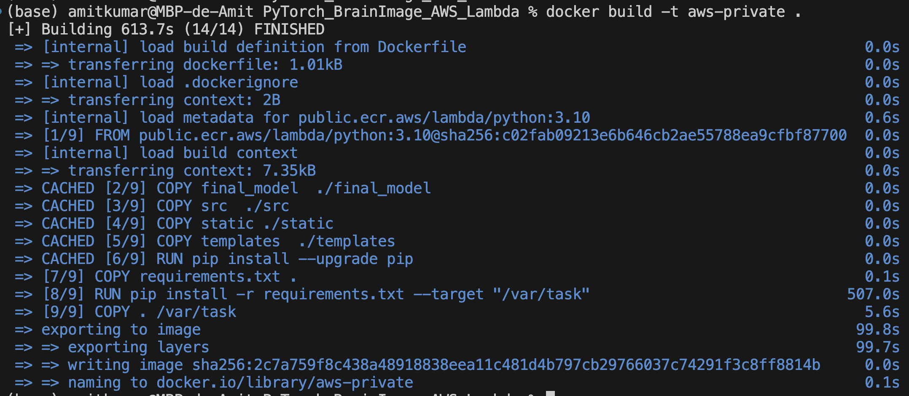

## PyTorch Brain Tumor Detection App powered by Self-attention module on AWS server

### Goal:
The goal of this project is to build CT scan tumor detection app using **self-attention module** and compare the performance with traditional **VGG16** architecture. We deploy the app on the **Google Cloud Run**, **Google Kubernetes Engine** and **AWS platform** to explore technical challenges involved in deploying PyTorch model on AWS and Google Cloud servers.

### To access the web app, click here: 
[PyTorch based WebApp for BrainTumor detection on AWS Cloud](https://iecusrbelq4pr5zjmdlsbgzbvy0kwait.lambda-url.us-east-1.on.aws/) 

### Instructions on how to host PyTorch app on AWS Cloud using docker container and AWS Lambda function

### 0.0 Signup for an AWS account and set up an AWS Free Tier alert and custom billing alert. Follow the instructions on the link below:
[Setup AWS account](https://aws-tc-largeobjects.s3-us-west-2.amazonaws.com/DEV-AWS-MO-GCNv2/exercise-1-account.html)
### 0.1 Create root user account, IAM user account using the official instruction given here: 
[Create IAM admin user account](https://aws-tc-largeobjects.s3-us-west-2.amazonaws.com/DEV-AWS-MO-GCNv2/exercise-2-iam.html)

Following the link above you would create:

1. **root** user account, setup multi-factor authentication by downloading **Authenticator** app on phone. You do not need to create **access key** for **root** user account.
2. Create **IAM Admin user** account and attach policy **AdministratorAccess**.
3. Create **IAM regular user account** and attach policies: **AWSLambda_FullAccess**, **AmazonElasticContainerRegistryPublicFullAccess**, **AmazonEC2FullAccess**,  
**AmazonEC2ContainerRegistryFullAccess** 
4. Create **access key** and **secret key** for **IAM user account** and store some where safe in your local machine. 

### 0.2 Now, for the rest of the exercies, we will loggin with IAM user account and create various AWS features. Make sure for this exercise you select one region as server location, say N Virginia or us-east-1 and use it for all services. Having multiple AWS serviecs with multiple server locations can incur additional charges. 

### 1.0 Create a private repository on Amazon Elastic Container Registry:
To do this you would search for **"Amazon Elastic Container Registry"** in the search bar of AWS website:
[AWS ECR](https://us-east-1.console.aws.amazon.com/ecr/get-started?region=us-east-1)

Click on **"Create repository"**:

Select visibility as **"private"**, enter the name of repository you want to create, say **"aws-private"**
Select all default options and click on **"Create** repository"
Now, you will see a new repository **"aws-private"** being created in private registry:

Now, select the repository **"aws-private"** and click on **"view push commands"**.
It will pop-up a window with the aws-cli command and docker build command which we will run on our local machine to authenticate the repository and push the docker image to AWS ECR. See the four commands in the image below:

### 1.1 Set up AWS CLI in your local machine macOS/Linux using access key and secret key of IAM user account.
    https://docs.aws.amazon.com/IAM/latest/UserGuide/id_credentials_access-keys.html
Type the following in your local terminal and it will prompt you to enter access key and secret key to be used for authentication:

    aws configure

To authenticate docker access to AWS resources, do the following. Open the following json file using favorite editor:

      emacs -nw  ~/.docker/config.json  # Create a json file
and, write the following content in the json file and replace it with your AWS user ID: 
   
   	{
                "auths": {
                        "131162195726.dkr.ecr.us-east-1.amazonaws.com": {}
                        }
    }%

To authenticate AWS ECR registry, run this command (shown in the image above in previous step) from your terminal:
 
    aws ecr get-login-password --region us-east-1 | docker login  --username AWS \
    --password-stdin 131162195726.dkr.ecr.us-east-1.amazonaws.com

Note, in the above command you would replace 131162195726 with your **user-id number**, and can be found in the image above.

    
Now, also run the following from terminal to authenticate **ecr-public**:

      aws ecr-public get-login-password --region us-east-1 | docker login \ --username AWS \
      --password-stdin public.ecr.aws

### 2. Flask.app, Requirement.txt Dockerfile
There are three main files that you would need to write to dockerize the package and host the web app:

	flask.app: Create custom HTTP server using a web framework like Flask and integrate html and ML model.
	
    requirement.txt: To specify/install packages required for ML model and Flask application
    
    Dockerfile: file to build docker container
    
    Notice, the code is slightly different compared to one used in Google Cloud Deployment due "handler function"** requirement in **AWS ECR and Lambda function.
    We will be using "serverless_wsgi" here.

In addition to these, we add machine learning model scripts:

    src/model.py: contains VGG16 model class inheriting the base class of nn.Module. 
    
    src/model_attention.py: contains self-attention module class inheriting the nn.Module base class.
    
	src/eval.py: script to load the model architecture and read the saved model weights.

To generate the model weight file for each architecture, check-out the git-hub code in the following repository:

	https://github.com/amitkr2410/MachineLearning/tree/main/PyTorch_BrainTumor

Alternatively, you can download the model files that I have uploaded on my Google Drive by following the command below:

	cd final_model/
	chmod +x download_models.sh
	./download_models.sh
	
It should download four model files inside directory "final_model/" :

	vgg16_pretrained_false_Run49.pth, only_attention_Run151.pth, 
	
	cnn_with_attention_Run101.pth, cnn_4layers_results_Run21.pth 
	

We will build the docker image using the base image from **public.ecr.aws/lambda/python:3.10**. Most of time users run into compatitbity issues with version of python to the python packgae specified in **requirement.txt**. So make sure they are compatible with each other.

### 3. (on local machine) Build the docker image locally

Now, it's time to build docker image to package entire machinery containing model files and neccessary packages. Let's choose **aws-private** as the name of the container image.

    docker build -t ${SOURCE-IMAGE}$  .
    docker build -t aws-private  .

    
### 4. (on local machine) To test the app locally:

 Comment out the following lines in **app.py**:

     if __name__ == "__main__":
     app.run(host='0.0.0.0', port=5000, debug=True)
and run **app.py** from the terminal:

    python app.py 

and open the localhost-url **http://127.0.0.1:5000**. 
Once done, revert the changes back.

### 5. (on local machine) Tag the docker image to be uploaded to the AWS ECR:

    docker tag aws-private:latest 131162195726.dkr.ecr.us-east-1.amazonaws.com/aws-private:latest

### 6. (on local machine) Push the image to AWS ECR private repository:

    docker push 131162195726.dkr.ecr.us-east-1.amazonaws.com/aws-private:latest

### 7. When you push an image, it is stored in the specified repository "aws-private".
After pushing your image, you can:

(a) Go to the **AWS ECR** to view the image.
        

### 8. Next, We will search for "Lambda function" in the search bar of AWS website:

8(a). Click on "create function" [here](https://us-east-1.console.aws.amazon.com/lambda/home?region=us-east-1#/discover) and fill the form:

 

Select the container image:

and choose default values.
Once the Lambda function is created, you will see the following:

Now, click on **"Configuration"** and **"Edit"** and fill:

      "Memory" = 2.5GB
      "Ephemeral storage" = 1GB (storage for /tmp dir)
      "Timeout" = 2 min 3 seconds
      "Execution role" = Use an exsisting role
      Choose a service-role and choose "policy"
      click save 
Note, the chosen IAM service-role can't be associated with another Lambda function.
      
Now, click on **"Configure Function URL"** and write:

      "ivoke mode" = Buffered
      "Configure cross-origin resource sharing (CORS)"
       click 'save'
       
Now, click on **"Test event"**: 

click on **"Create new event"** and write the name of new event **"aws-pytorch-event"**
    and choose **'private'** as event sharing settings
    and set Template as **"apigateway-aws-proxy"**
    
In the event JSON area, change the following tag as:

         "path": "/",
         "httpMethod": "GET",
         "proxy"= '/'
         
see for an example:

Now, click **"save"**.

### 9. Visit the following link:  
Now, find the **"Function URL"** link (in blue color) on right-hand pangel, just below the **"Function ARN"**. This is your public end-point.        
        

In the above image, the URL of our web app is [https://iecusrbelq4pr5zjmdlsbgzbvy0kwait.lambda-url.us-east-1.on.aws/](https://iecusrbelq4pr5zjmdlsbgzbvy0kwait.lambda-url.us-east-1.on.aws/)

Type this in your web-browser to interact with your app and make predictions.
The webpage should appear as:

 ====================================================================================================

### **Note, if you're not in free tier, it can be expensive to run applications on AWS Cloud. Watch out for charges and create billing alerts to be safe. 
### **To see the training stages involved in the developing the ML model, see the repository:
    https://github.com/amitkr2410/MachineLearning/tree/main/PyTorch_BrainTumor
    
This should be used to generate model files. Alternatively, you can download the model files by
running the script **./download\_models.sh** inside **final\_model/** directory. It will download model files:

	only_attention_Run151.pth, vgg16_pretrained_false_Run49.pth, 
	
	cnn_4layers_results_Run21.pth, and cnn_with_attention_Run101.pth