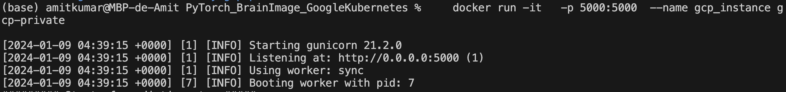

## PyTorch Brain Tumor Detection App powered by Self-attention module on Google Cloud server

### Goal:
The goal of this project is to build CT scan tumor detection app using **self-attention module** and compare the performance with traditional **VGG16** architecture. We deploy the app on the **Google Cloud Run**, **Google Kubernetes Engine** and **AWS platform** to explore technical challenges involved in deploying PyTorch model on AWS and Google Cloud servers.

### To access the web app, click here:

[PyTorch based WebApp for BrainTumor detection on GoogleCloudRun](https://gcpimagee-rffjbusgsa-ue.a.run.app/) 

### Instructions on how to host PyTorch app on Google Cloud Run using docker container and Flask app

### 0.0 Create a project here:

[https://cloud.google.com/resource-manager/docs/creating-managing-projects#console
](https://cloud.google.com/resource-manager/docs/creating-managing-projects#console)

    Got to "Creating a project" --> "Console" --> click "Go to Manage Resources"
    Click on "Create Project"
    Enter "Project Name" , "Location", and click "Create"
    Notice the Project ID, it will be used later

For an example:

    
### 0.1 Authenticate gcloud in your local machine using:
    gcloud auth login
    gcloud config set project ${PROJECT_ID}
    gcloud config set project numeric-pilot-409621

### 1. Create a repository on Artifact Registry in GCP:

You can create manually here:

     https://cloud.google.com/artifact-registry

I have created a repository name **"pytorch-braintumor"** by clicking on the **Create Repository** button. We will upload our **docker** image here.

    

##### **Make sure to select Budgets and Alerts item-- fill the form to create alert if the usage exceed and certain dollor value.

Visit [https://cloud.google.com/artifact-registry](https://cloud.google.com/artifact-registry) and click on **'Go to consloe'** icon, and you should be able to see **"pytorch-braintumor"** repository.
   
### 2. (on local machine) Docker authenication to Google Artifact repository:

#### (a) Using credential helper:

Open the following file **"~/.docker/config.json"** from terminal in your local machine
and add the **json entry** shown below:
       
       "credHelpers": {
        "asia.gcr.io": "gcloud",
        "eu.gcr.io": "gcloud",
         "gcr.io": "gcloud",
        "marketplace.gcr.io": "gcloud",
         "northamerica-northeast1-docker.pkg.dev": "gcloud",
         "us-central1-docker.pkg.dev": "gcloud",
         "us-east1-docker.pkg.dev": "gcloud",
         "us.gcr.io": "gcloud"
         }
       
Now, run the following command to add one of the host:

    gcloud auth configure-docker us-east1-docker.pkg.dev
    gcloud artifacts locations list

### 3. Flask.app, Requirements.txt, Dockerfile, and index.html
There are three main files that you would need to write to dockerize the package and host the web app:

	flask.app: Create custom HTTP server using a web framework like Flask and integrate html and ML model.
	
    requirements.txt: To specify/install packages required for ML model and Flask application.
    
    Dockerfile: file to build docker container.
    
    /static/index.html: html code with css decorator to publish the web app.
    
    /templates/: A directory to store images and use them to host on the web app.
    
 Notice, the code for **Dockerfile** and **flask.app** is slightly different compared to one used in **AWS Lambda based** Deployment project due "handler function"** requirement in **AWS ECR and Lambda function.
    However, no such constaint in GCP. So, we will be using "gunicorn", a python based Web Server Gateway Interface HTTP Server to run on top of flask server.

In addition to these, we add machine learning model scripts:

    src/model.py: contains VGG16 model class inheriting the base class of nn.Module. 
    
    src/model_attention.py: contains self-attention module class inheriting the nn.Module base class.
    
	src/eval.py: script to load the model architecture and read the saved model weights.

To generate the model weight file for each architecture, check-out the git-hub code in the following repository:

	https://github.com/amitkr2410/MachineLearning/tree/main/PyTorch_BrainTumor

Alternatively, you can download the model files that I have uploaded on my Google Drive by following the command below:

	cd final_model/
	chmod +x download_models.sh
	./download_models.sh
	
It should download four model files inside directory "final_model/" :

	vgg16_pretrained_false_Run49.pth, only_attention_Run151.pth, 
	
	cnn_with_attention_Run101.pth, cnn_4layers_results_Run21.pth 
	

We will build the docker image using the base image **python:3.10** . Most of time users run into compatitbity issues with version of python to the python packgae specified in **requirements.txt**. So make sure they are compatible with each other.

   
### 3. (on local machine) Build the docker image locally

Note, the command to create and upload the docker image to **Google Artifact repository** will be same regardless where you want to host the image using **Google Cloud Run** or **Google Kubernetes Engine**. 

Let's go ahead and execute the following command:

    docker build -t ${SOURCE-IMAGE}$  .
    docker build -t gcp-private  .

To read more visit here: [https://cloud.google.com/artifact-registry/docs/docker/pushing-and-pulling](https://cloud.google.com/artifact-registry/docs/docker/pushing-and-pulling)
    
### 4. (on local machine) Testing the built image locally to make sure things are working properly before pushing to Google Cloud
    docker run -it   -p 5000:5000  --name gcp_instance gcp-private
    
    where 5000:5000 specify the port number for gunicorn server and flask app server
it is not advised to use flask server directly for production, hence
we use gunicorn server on top of the flask.
Now, open [http://0.0.0.0:5000](http://0.0.0.0:5000) in your web-browser such as chrome.

Also, to test the app locally one can run the following at the terminal:

    python app.py 
    
and open the localhost url: [http://127.0.0.1:5000](http://127.0.0.1:5000) from the web browser. 

### 7. (on local machine) Tag the docker image to be uploaded to the Google Artifact registry:

    docker tag gcp-private  us-east1-docker.pkg.dev/numeric-pilot-409621/pytorch-braintumor/gcpimage
    docker tag ${SOURCE-IMAGE} ${LOCATION-docker.pkg.dev/PROJECT-ID/REPOSITORY/IMAGE:TAG}
    
where **numeric-pilot-409621** is the name of **PROJECT-ID**, and **gcpimage** is the name of repository created in the begining.

### 8. (on local machine) Push the image to Google Artifact registry:

	   docker push us-east1-docker.pkg.dev/numeric-pilot-409621/pytorch-braintumor/gcpimage
   
   	   docker push LOCATION-docker.pkg.dev/PROJECT-ID/REPOSITORY/IMAGE

### 9. When you push an image, it is stored in the specified repository "pytorch-braintumor".
After pushing your image, you can
go to the Google Cloud console to view the image:
[https://console.cloud.google.com/artifacts/](https://console.cloud.google.com/artifacts/)
        

Alternatively, you can run the gcloud command to view the image's tags and automatically-generated digest:

        gcloud artifacts docker images list \
            LOCATION-docker.pkg.dev/PROJECT-ID/REPOSITORY/IMAGE [--include-tags] 
              
        gcloud artifacts docker images list us-east1-docker.pkg.dev/numeric-pilot-409621/pytorch-braintumor/gcpimage

### 7. Next, we will use "Google Cloud Run" service to host the app:
7(a).1 Open **"Cloud Run"** by using the following link:  [https://cloud.google.com/run](https://cloud.google.com/run) 

.2 Now, click on **"Create Service"** on the **"Cloud Run"** page.

.3 Select the image you just pushed into **Artifact container registry**.
            
            Choose "Deploy one revision from an existing container image"
            Set "service name" == gcpimage
            Set "Region" == us-east1
            Set "CPU is only allocated during request processing"
 
             "Minimum numbers of instances==1"
            "Maximum numbers of instances==5"
            "Allow direct access to your service from the Internet == yes"
            "Allow unauthenticated invocations==yes"
            "Container port ==5000"
            "Memory==1GB, cpu==1"    
            "Request timeout ==60"
            "Maximum concurrent requests per instance ==10"
            "Execution environment ==default"
            "Startup CPU boost == NO"   
                       
 

 
        

### Next, click on "Create" button. After few minutes, the app will be deployed. The endpoint address can be found in the image below with label "URL" written next to **Region: us-east1**:        

### In the above image, the URL of web app is [https://gcpimagee-rffjbusgsa-ue.a.run.app/](https://gcpimagee-rffjbusgsa-ue.a.run.app/)

### Type this in your web browser to view your app and make prediction.
### The webpage should appear as shown below:

 =======================================================================================================

 =======================================================================================================

### **Note, if you're not in free tier, it can be expensive to run applications on Google Cloud Run. Watch out for charges and create billing alerts to be safe. 
### **To see the training stages involved in  developing ML models, visit the following repository:
    https://github.com/amitkr2410/MachineLearning/tree/main/PyTorch_BrainTumor

This should be used to generate model files. Alternatively, you can download the model files by
running the script **./download\_models.sh** inside **final\_model/** directory. It will download model files:

	only_attention_Run151.pth, vgg16_pretrained_false_Run49.pth, 
	
	cnn_4layers_results_Run21.pth, and cnn_with_attention_Run101.pth