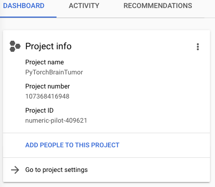
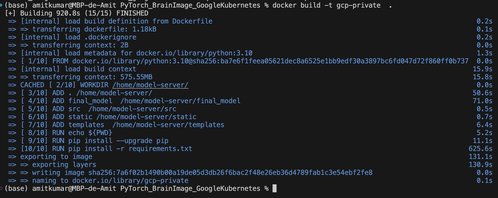
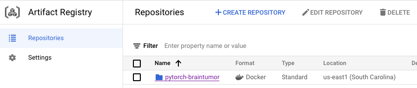
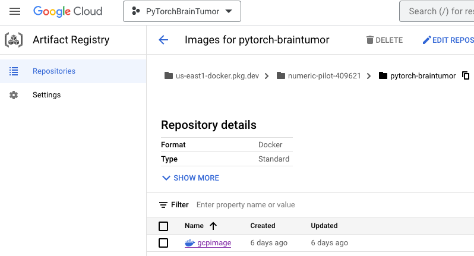
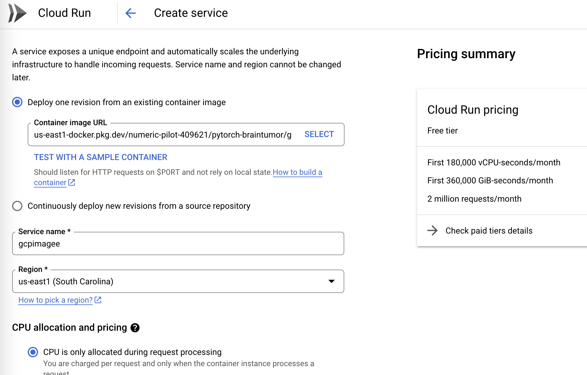
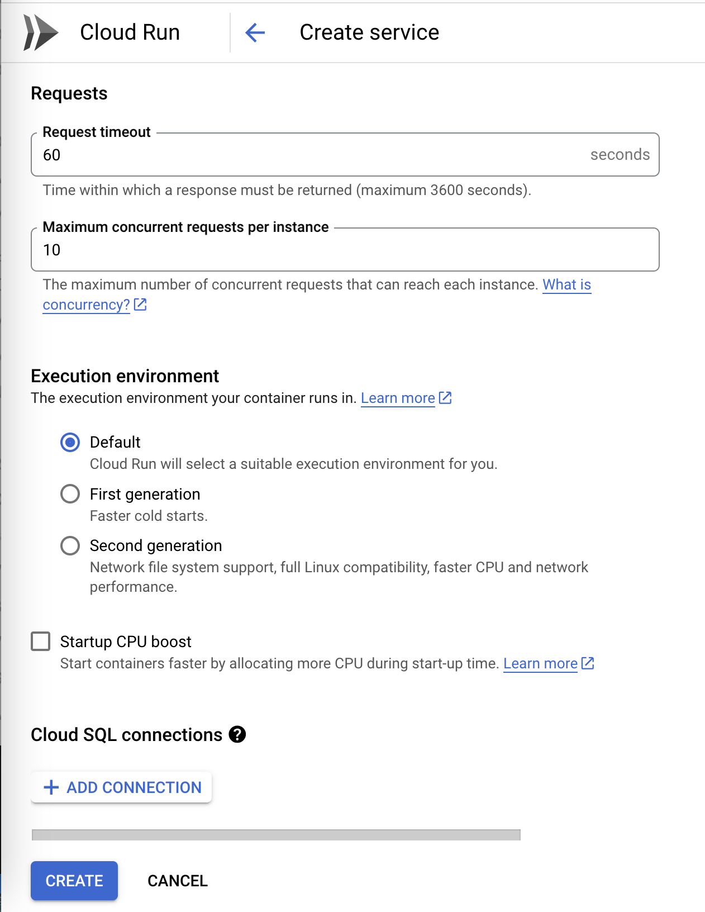
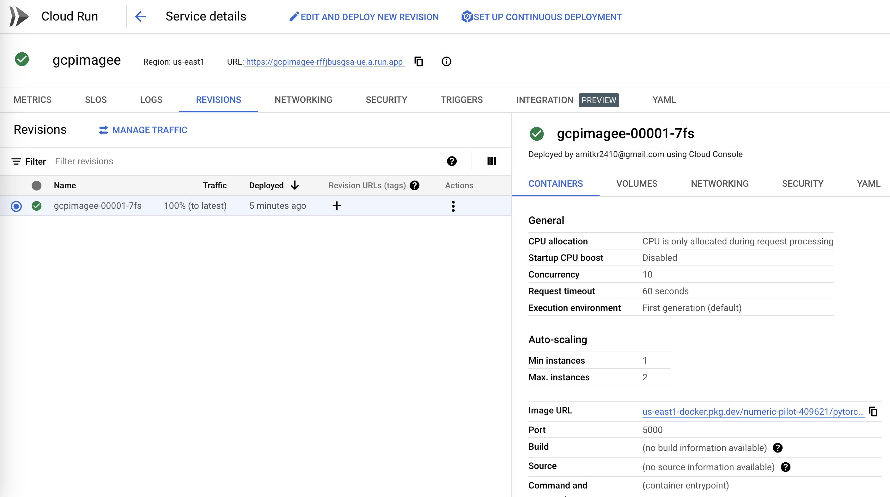
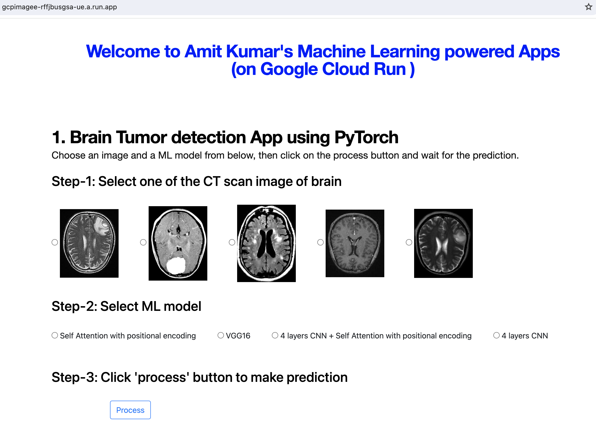

### Goal:
The goal of this project is to build CT scan tumor detection app using self attention module and compare the performance with traditional VGG16 architecture. We deploy the app on the Google Cloud Run, Google Kubernetes Engine and AWS platform to explore technical challenges involved in deploying PyTorch model on AWS and Google Cloud servers.
### To access the web app, click here:

[PyTorch based WebApp for BrainTumor detection on GoogleCloudRun](https://gcpimagee-rffjbusgsa-ue.a.run.app/) 

### Instructions on how to host PyTorch app using Google Cloud Run service

### 0.0 Create a project here:
https://cloud.google.com/resource-manager/docs/creating-managing-projects#console
    Got to "Creating a project" --> "Console" --> click "Go to Manage Resources"
    Click on "Create Project"
    Enter "Project Name" , "Location", and click "Create"
    Notice the Project ID, it will used later

For an example:

    
### 0.1 Authenticate gcloud in your local machine using:
    gcloud auth login
    gcloud config set project ${PROJECT_ID}
    gcloud config set project numeric-pilot-409621

### 0.2 Flask.app, Requirement.txt Dockerfile
    Flask.app: Create custom HTTP server using a web framework like Flask
    Requirement.txt: To specify/install packages reuired for ML model
    Dockerfile: Build docker container

### 1. Create Target repository on the Artifact registry
### 2. (on local machine) Authenication of the repository
(a) Using credential helper:
       Open the following file "~/.docker/config.json"
       and add the below json entries
       #'''
       "credHelpers": {
        "asia.gcr.io": "gcloud",
        "eu.gcr.io": "gcloud",
         "gcr.io": "gcloud",
        "marketplace.gcr.io": "gcloud",
         "northamerica-northeast1-docker.pkg.dev": "gcloud",
         "us-central1-docker.pkg.dev": "gcloud",
         "us-east1-docker.pkg.dev": "gcloud",
         "us.gcr.io": "gcloud"
         }
       #'''
Now run the following command to add one of the host:
    gcloud auth configure-docker us-east1-docker.pkg.dev
    gcloud artifacts locations list

### 3. (on local machine) Build the docker image locally
    docker build -t ${SOURCE-IMAGE}$  .
    docker build -t gcp-private  .

To read more visit here: https://cloud.google.com/artifact-registry/docs/docker/pushing-and-pulling
    
### 4. (on local machine) Testing the built image locally to make sure things are working properly before pushing to google cloud
    docker run -it   -p 5000:5000  --name gcp_instance gcp-private
    
    where 5000:5000 specify the port number for gunicorn server and flask app server
it is not advised to use flask server directly for production, hence
we use gunicorn server on top of the flask.
Now click on http://0.0.0.0:5000 in the web-browser such as chrome.

Also to test the app locally one can run the following at the terminal:
    python app.py 
and open the localhost url http://127.0.0.1:5000 

### 5. Create a repository on Artifact Registry on GCP
You can create manually here:
     https://cloud.google.com/artifact-registry
or using the following command:
   gcloud beta artifacts repositories create $REPO_NAME \
   — repository-format=docker \
   — location=$REGION
I have created a repository name "pytorch-braintumor"

Make sure to select Budgets and Alerts -- fill the form to create alert if the usage exceed and certain dollor value.

### 6. Visit https://cloud.google.com/artifact-registry
   and click on 'Go to consloe' icon and you should be able to see "pytorch-braintumor"

### 7. (on local machine) Tag the docker image to be uploaded to the google cloud
    docker tag gcp-private  us-east1-docker.pkg.dev/numeric-pilot-409621/pytorch-braintumor/gcpimage
    docker tag ${SOURCE-IMAGE} ${LOCATION-docker.pkg.dev/PROJECT-ID/REPOSITORY/IMAGE:TAG}

### 8. (on local machine) Push the image to google clooud
   docker push us-east1-docker.pkg.dev/numeric-pilot-409621/pytorch-braintumor/gcpimage
   docker push LOCATION-docker.pkg.dev/PROJECT-ID/REPOSITORY/IMAGE

### 9. When you push an image, it is stored in the specified repository "pytorch-braintumor".
After pushing your image, you can:
(a) Go to the Google Cloud console to view the image.
        https://console.cloud.google.com/artifacts/
        

(b) Run the gcloud command to view the image's tags and automatically-generated digest:
        gcloud artifacts docker images list \
            LOCATION-docker.pkg.dev/PROJECT-ID/REPOSITORY/IMAGE [--include-tags]   
        gcloud artifacts docker images list us-east1-docker.pkg.dev/numeric-pilot-409621/pytorch-braintumor/gcpimage

### 7. Next, We will use "Google Cloud Run" to host the host the app:
7(a).1 Using "Cloud Run" to host the webapp
.2 Visit the following link:  
        https://cloud.google.com/run 

.3 You can now click on "Create Service" on the "Cloud Run" page.

.4 Select the image you just pushed into Artifact container registry.
            "Deploy one revision from an existing container image"
            "service name" == gcpimage
            "Region" == us-east1
            "CPU is only allocated during request processing"
 
            "Minimum numbers of instances==1"
            "Maximum numbers of instances==5"
            "Allow direct access to your service from the Internet == yes"
            "Allow unauthenticated invocations==yes"
            "Container port ==5000"
            "Memory==1GB, cpu==1"    
            "Request timeout ==60"
            "Maximum concurrent requests per instance ==10"
            "Execution environment ==default"
            "Startup CPU boost == NO"    
        

Now click on "Create". After few minutes, the app will be deployed. The endpoint address can be found here on the top with label "URL":        

In the above image, the URL of web app is https://gcpimagee-rffjbusgsa-ue.a.run.app/
Type this in your web browser to interact with your app and make prediction.
The webpage should appear as:

### Note, if you're not in free tier, it can be expensive to run applications on Google Cloud Run. Watch out for charges and create billing alerts to be safe. 
### To see the training stages involved in the developing the ML model, see the repository:
    https://github.com/amitkr2410/MachineLearning/tree/main/PyTorch_BrainTumor
This should be used to generate model files. Alternatively, you can download the model files by
running the script "./download_models.sh" inside "final_model" directory. It will download model files: only_attention_Run151.pth, vgg16_pretrained_false_Run49.pth, cnn_4layers_results_Run21.pth, and cnn_with_attention_Run101.pth