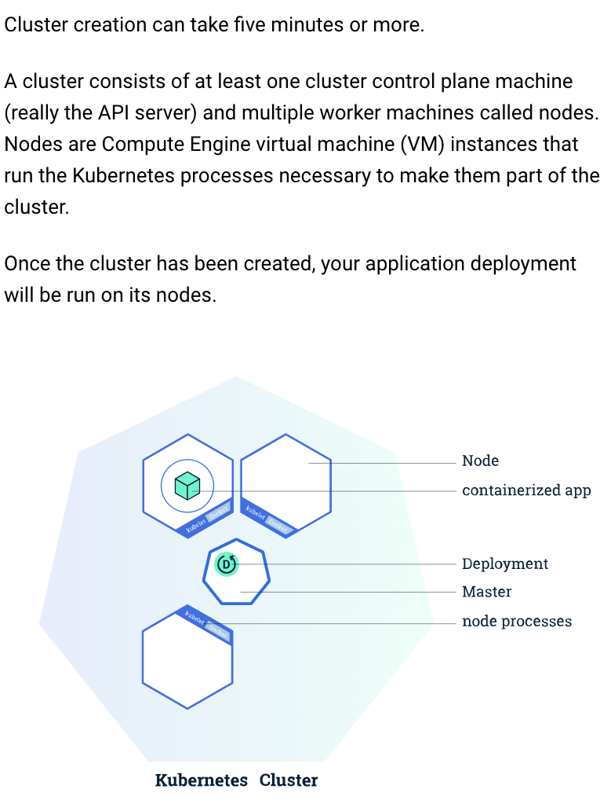

## Goal:
The goal of this project is to build CT scan tumor detection app using self-attention module and compare the performance with traditional VGG16 architecture. We deploy the app on the Google Cloud Run, Google Kubernetes Engine and AWS platform to explore technical challenges involved in deploying PyTorch model on AWS and Google Cloud servers.

### Instruction on how to host PyTorch app on the Google Kubernetes Engine

### 0.0 Create a project here:
    https://cloud.google.com/resource-manager/docs/creating-managing-projects#console
    Got to "Creating a project" --> "Console" --> click "Go to Manage Resources"
    Click on "Create Project"
    Enter "Project Name" , "Location", and click "Create"
    Notice the Project ID, it will used later

    For an example:
    
    
### 0.1 Authenticate gcloud in your local machine using:
    gcloud auth login
    gcloud config set project ${PROJECT_ID}
    gcloud config set project numeric-pilot-409621

### 0.2 Flask.app, Requirement.txt Dockerfile
    Flask.app: Create custom HTTP server using a web framework like Flask
    Requirement.txt: To specify/install packages reuired for ML model
    Dockerfile: Build docker container

### 1. Create Target repository on the Artifact registry
### 2. (on local machine) Authenication of the repository
   (a) Using credential helper:
       Open the following file "~/.docker/config.json"
       and add the below json entries
       #'''
       "credHelpers": {
        "asia.gcr.io": "gcloud",
        "eu.gcr.io": "gcloud",
         "gcr.io": "gcloud",
        "marketplace.gcr.io": "gcloud",
         "northamerica-northeast1-docker.pkg.dev": "gcloud",
         "us-central1-docker.pkg.dev": "gcloud",
         "us-east1-docker.pkg.dev": "gcloud",
         "us.gcr.io": "gcloud"
         }
       #'''
    Now run the following command to add one of the host:
    gcloud auth configure-docker us-east1-docker.pkg.dev
    gcloud artifacts locations list

### 3. (on local machine) Build the docker image locally
    docker build -t ${SOURCE-IMAGE}$  .
    docker build -t gcp-private  .
    

To read more visit here: https://cloud.google.com/artifact-registry/docs/docker/pushing-and-pulling
    
### 4. (on local machine) Testing the built image locally to make sure things are working properly before pushing to google cloud
    docker run -it   -p 5000:5000  --name gcp_instance gcp-private
    
    #5000:5000 specify the port number for gunicorn server and flask app server
    #it is not advised to use flask server directly for production, hence
    #we use gunicorn server on top of the flask.
    Now click on http://0.0.0.0:5000 in the web-browser such as chrome.
    

    #Also to test the app locally one can run the following at the terminal:
    python app.py 
    #and open the localhost url http://127.0.0.1:5000 

### 5. Create a repository on Artifact Registry on GCP
   #You can create manually here:
     https://cloud.google.com/artifact-registry
   #or using the following command:
   gcloud beta artifacts repositories create $REPO_NAME \
   — repository-format=docker \
   — location=$REGION
   #I have created a repository name "pytorch-braintumor"
    
    Make sure to select Budgets and Alerts -- fill the form to create alert if the usage exceed and certain dollor value.

### 6. Visit https://cloud.google.com/artifact-registry
   and click on 'Go to consloe' icon and you should be able to see "pytorch-braintumor"

### 7. (on local machine) Tag the docker image to be uploaded to the google cloud
    docker tag gcp-private  us-east1-docker.pkg.dev/numeric-pilot-409621/pytorch-braintumor/gcpimage
    docker tag ${SOURCE-IMAGE} ${LOCATION-docker.pkg.dev/PROJECT-ID/REPOSITORY/IMAGE:TAG}

### 8. (on local machine) Push the image to google clooud
   docker push us-east1-docker.pkg.dev/numeric-pilot-409621/pytorch-braintumor/gcpimage
   docker push LOCATION-docker.pkg.dev/PROJECT-ID/REPOSITORY/IMAGE

### 9. When you push an image, it is stored in the specified repository "pytorch-braintumor".
    After pushing your image, you can:
        (a) Go to the Google Cloud console to view the image.
        https://console.cloud.google.com/artifacts/
        
        

        (b) Run the gcloud command to view the image's tags and automatically-generated digest:
        gcloud artifacts docker images list \
            LOCATION-docker.pkg.dev/PROJECT-ID/REPOSITORY/IMAGE [--include-tags]   
        gcloud artifacts docker images list us-east1-docker.pkg.dev/numeric-pilot-409621/pytorch-braintumor/gcpimage

### 10. Next, We will use "Google Kubernetes" to host the app:
###  10.1.0  Using Google Kubernetes Engine API:
        # Google Kubernetes builds and manages container-based applications, powered by the open source Kubernetes technology.
        .1.1 go to Artifcat Registry and click on the uploaded docker image, and from
             the drop down menu select deploy to GKE.
            

        .2. Enable Kubernetes Engine API
        .3. This leads to 'create a deployment' page
        .3.1 New Container   
             select 'Existing container image'
             
        .4.1 Configuration
             Select deployment name='google-kubernetes-pytorch-amit'
             Select Namespace='default'
             Labels  --> use default
        .5.1 Configuration YAML
              #Kubernetes deployments are defined declaratively using YAML files. 
              #The best practice is to store these files in version control, 
              #so that you can track changes to your deployment configuration over time.      
             Cluster
              'Zone == us-east1-b'  
        .6.1  Expose
              'Expose deployment as a new service'  
               Port mapping
               'Port 1 =5000'
               'Protocol 1 = TCP'
               'Service type = load balancer'
                
         .7.1. It will deploy the model and create a public endpoint
               Copy the public endpoint address and paste it in browser
               
               See the bottom line with endpoint address: http://34.148.10.95:5000/  
         .7.2. To view montior the app and see endpoint later:
               Open "Kubernetes Engine" page and click on "Workloads". The page is 
               allow you to see graphs of CPU, Memory, Disk usages by the app. 
               At the bottom of the page, you will find the location of endpoint.
               Paste the endpoint in the browser and you should see the following page:
                            

### Note, if you're not in free tier, it can be expensive to run applications on Google Kubernetes. Charges @$0.1 per hour for using the cluster alone. 
### To see the training stages involved in the developing the ML model, see the repository:
    [amitkr2410/MachineLearning](https://github.com/amitkr2410/MachineLearning/tree/main/PyTorch_BrainTumor)

    