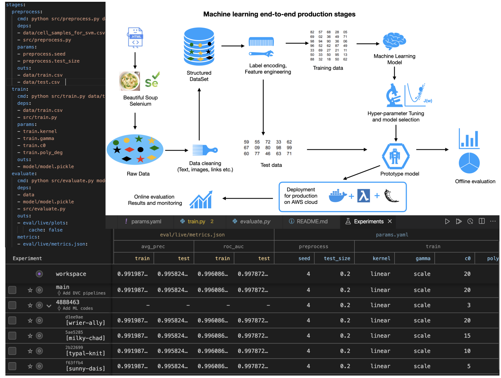

# MachineLearning-Deployment
Explore all stages from preparation to deployment of machine learning models. Using DVC, VS code, FLask, AWS, python and docker.

### The final project deployed on AWS server can be accessed via the following link (may take 2 mins to load website):
[AWS Web APP Machine Learning](https://uw44cshh4a23jlvucfhjbyllye0lvsfb.lambda-url.us-east-1.on.aws)
### The full website outlining projects can be accessed here (may take 2 mins to load website):
[Amit's Personal HomePage](https://tfzfmiug4if622cp6ml7dlqt2e0njauz.lambda-url.us-east-1.on.aws/)

### For Machine learning experimentation, we build DVC pipelines. 
### In below, we present a typical ML architecture, a layout of DVC pipelines and ML experimentation for prototyping a model.

